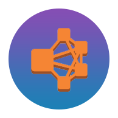

Solodev is the world's first on-demand web experience platform created by developers for developers. It empowers organizations to create amazing websites with unparalleled levels of security, scalability and total design freedom. Featuring enterprise web content and experience management, Solodev was developed to truly support the custom design requirements that customers demand - beautiful, engaging websites without compromise.

## Built For AWS
Focus on your business, not the technological infrastructure that powers it. Solodev and AWS free you up to focus on your customers, not the heavy lifting of racking, stacking and powering servers.

## Launch Options
<table>
	<tr>
		<td></td>
		<td>Solodev Lite</td>
		<td>Solodev CMS, PHP, Apache, MySQL, and Mongo on a single web server</td>
		<td><a href="pages/solodev-cms-lite.md">Details</a></td>
	</tr>
	<tr>
		<td></td>
		<td>Solodev Pro</td>
		<td>Solodev CMS, PHP, Apache, Mongo on a single web server with an external RDS MySQL database</td>
		<td><a href="pages/solodev-cms-pro.md">Details</a></td>
	</tr>
	<tr>
		<td></td>
		<td>Solodev Enterprise (Opsworks)</td>
		<td>Solodev CMS on a high-available / redundant architecture managed by AWS Opsworks.</td>
		<td><a href="pages/solodev-cms-enterprise-opsworks.md">Details</a></td>
	</tr>
	<tr>
		<td></td>
		<td>Solodev Enterprise (AutoScalingGroup)</td>
		<td>Solodev CMS on a high-available / redundant architecture managed by a combination AWS AutoScaling and Lambda.</td>
		<td><a href="pages/solodev-cms-enterprise-autoscaling.md">Details</a></td>
	</tr>
</table>

## Features
Enterprise Website Software, Hosting & Support. It's all here in the cloud.

<table>
	<tr>
		<th>Feature</th>
		<th>Lite</th>
		<th>Pro</th>
		<th>Enterprise</th>
	</tr>
	<tr>
		<td>Web Studio</td>
		<td></td>
		<td></td>
		<td></td>
	</tr>
	<tr>
		<td>Modules + Forms</td>
		<td></td>
		<td></td>
		<td></td>
	</tr>
	<tr>
		<td>Users + Permissions</td>
		<td></td>
		<td></td>
		<td></td>
	</tr>
	<tr>
		<td>Scheduling + Versioning</td>
		<td></td>
		<td></td>
		<td></td>
	</tr>
	<tr>
		<td>Landing Pages + Blog + Experiments</td>
		<td></td>
		<td></td>
		<td></td>
	</tr>
	<tr>
		<td>Staging Server</td>
		<td></td>
		<td></td>
		<td></td>
	</tr>
	<tr>
		<td>External Database</td>
		<td></td>
		<td></td>
		<td></td>
	</tr>
	<tr>
		<td>Load Balancing</td>
		<td></td>
		<td></td>
		<td></td>
	</tr>
	<tr>
		<td>Workflows</td>
		<td></td>
		<td></td>
		<td></td>
	</tr>
	<tr>
		<td>Integrations</td>
		<td></td>
		<td></td>
		<td></td>
	</tr>
	<tr>
		<td>Tasks</td>
		<td></td>
		<td></td>
		<td></td>
	</tr>
	<tr>
		<td>Theme Builder</td>
		<td></td>
		<td></td>
		<td></td>
	</tr>
	<tr>
		<td>API Access</td>
		<td></td>
		<td></td>
		<td></td>
	</tr>
</table>

## Case Studies
We’re launching our partners to new worlds of digital success. Read how in our mission case studies. [View all case studies...](https://www.solodev.com/resources/case-studies/)

<table>
	<tr>
		<th><a href="https://www.solodev.com/resources/case-studies/oneblood.stml">OneBlood</a></th>
		<th><a href="https://www.solodev.com/resources/case-studies/seminole-county-public-schools.stml">Seminole County Public Schools</a></th>
		<th><a href="https://www.solodev.com/resources/case-studies/miami-beach-visitor-and-convention-authority.stml">Miami Beach VCA</a></th>
	</tr>
	<tr>
		<td></td>
		<td></td>
		<td></td>
	</tr>
</table>
<table>
	<tr>
		<th><a href="https://www.solodev.com/resources/case-studies/cnl-financial.stml">CNL Financial</a></th>
		<th><a href="https://www.solodev.com/resources/case-studies/bridgeway-community-church.stml">Bridgeway Community Church</a></th>
		<th><a href="https://www.solodev.com/resources/case-studies/florida-dairy-farmers.stml">Florida Dairy Farmers</a></th>
	</tr>
	<tr>
		<td></td>
		<td></td>
		<td></td>
	</tr>
</table>

## Support
Houston, we have no problems – because Solodev has your back at every step, with 24x7x365 U.S. based support. From our world-class HelpDesk, email support, phone access, or face-to-face training sessions, you've got the best team in the business to help your mission succeed.
* Submit online support tickets
* Access dedicated support team members who know your business
* Benefit from in-depth product training from the Solodev Team
* Benefit from in-depth product training from the Solodev Team

Solodev users come in all shapes and sizes from the Solo-developer (the Solodev) to Fortune 500 companies with a staff of 500+ managing their websites and technological infrastructure.

Solodev is positioned to handle both ends of the spectrum and everything in between through our in-depth training and certification programs. Whether you’re a Solodev or a Fortune 500 company, Solodev has a solution to get you up and running in the Solodev platform in no time!

---
© 2018 Solodev. All rights reserved. 

Errors or corrections? Email us at help@solodev.com.

---
Visit [solodev.com](https://www.solodev.com/) to learn more.