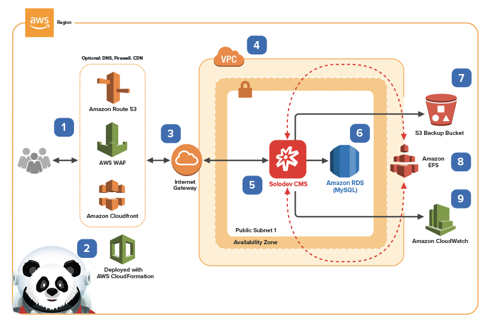
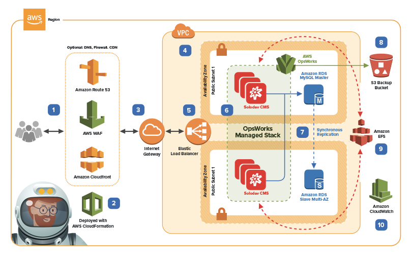
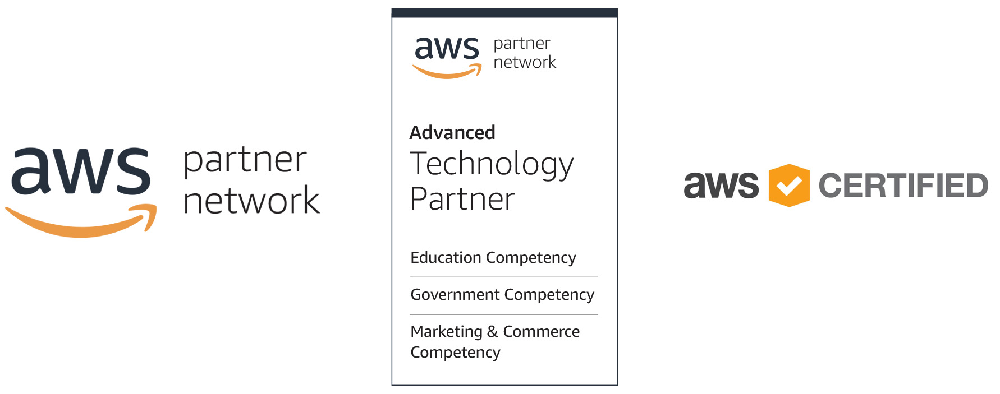

<b>Explore the outer limits of your digital universe with Solodev: the CMS for AWS.</b> Built from the ground up to integrate with the full stack of AWS cloud technologies, Solodev CMS (Content Management System) lets you build, launch, and manage amazing websites and engaging digital experiences – all with advanced, enterprise-level functionality and unparalleled levels of scalability, redundancy, and security. 

Whether you’re a designer, developer, or marketer, Solodev gives you the best of all worlds. Take full command of your code or laser-focus on your content; the choice is yours. Create beautiful websites with total design freedom and responsive HTML. Develop powerful portals and data-driven applications with API integrations and custom PHP. Launch your most ambitious ideas with Solodev – available on-demand with an AWS Marketplace subscription.

## Choose Your Solodev Stack
Mission control, we have options! Choose from a range of Solodev CMS products that fit your needs – and launch your stack in seconds:

|				|			  	|
| ------------- | ------------- |
|   | <strong><h3><a href="pages/solodev-cms-lite.md">Solodev CMS - Lite Edition</a></h3></strong>The perfect launch pad for small development projects, Solodev Lite Edition gives you optimal control in a streamlined package. Pack your ship with best-of-breed CMS features, access to PHP, Apache, MySQL, and Mongo all on a single web server. Includes YAML templates for <a href="http://docs.aws.amazon.com/AmazonVPC/latest/UserGuide/VPC_Introduction.html">Amazon Virtual Private Cloud (VPC)</a>, <a href="http://docs.aws.amazon.com/AWSEC2/latest/UserGuide/concepts.html">Amazon Elastic Compute Cloud (EC2)</a>,  <a href="https://docs.aws.amazon.com/AmazonS3/latest/dev/Welcome.html">Amazon Simple Storage Service (S3)</a>, and <a href="https://docs.aws.amazon.com/AmazonCloudWatch/latest/monitoring/WhatIsCloudWatch.html">Amazon CloudWatch</a>.  <strong>Quick Launch:</strong> <a href="https://console.aws.amazon.com/cloudformation/home?region=us-east-1#/stacks/new?stackName=solodev-cms&templateURL=https://s3.amazonaws.com/solodev-aws-ha/aws/solodev-lite-single.yaml">(us-east-1)</a> 
		<a href="pages/solodev-cms-lite.md"> </a>  |
| Content Cell  | Content Cell  |
<table>
	<tr>
		<td width="50%"></td>
		<td width="50%"><strong><h3><a href="pages/solodev-cms-lite.md">Solodev CMS - Lite Edition</a></h3></strong>The perfect launch pad for small development projects, Solodev Lite Edition gives you optimal control in a streamlined package. Pack your ship with best-of-breed CMS features, access to PHP, Apache, MySQL, and Mongo all on a single web server. Includes YAML templates for <a href="http://docs.aws.amazon.com/AmazonVPC/latest/UserGuide/VPC_Introduction.html">Amazon Virtual Private Cloud (VPC)</a>, <a href="http://docs.aws.amazon.com/AWSEC2/latest/UserGuide/concepts.html">Amazon Elastic Compute Cloud (EC2)</a>,  <a href="https://docs.aws.amazon.com/AmazonS3/latest/dev/Welcome.html">Amazon Simple Storage Service (S3)</a>, and <a href="https://docs.aws.amazon.com/AmazonCloudWatch/latest/monitoring/WhatIsCloudWatch.html">Amazon CloudWatch</a>.  <strong>Quick Launch:</strong> <a href="https://console.aws.amazon.com/cloudformation/home?region=us-east-1#/stacks/new?stackName=solodev-cms&templateURL=https://s3.amazonaws.com/solodev-aws-ha/aws/solodev-lite-single.yaml">(us-east-1)</a> 
		<a href="pages/solodev-cms-lite.md"> </a></td>
	</tr>
	<tr>
		<td width="50%"></td>
		<td width="50%"><strong><h3><a href="pages/solodev-cms-pro.md">Solodev CMS - Professional Edition</a></h3></strong>Take command of your digital universe with the power of Solodev CMS, PHP, Apache, and Mongo on a single web server with an external RDS MySQL database. Includes YAML templates for <a href="http://docs.aws.amazon.com/AmazonVPC/latest/UserGuide/VPC_Introduction.html">Amazon Virtual Private Cloud (VPC)</a>, <a href="http://docs.aws.amazon.com/AWSEC2/latest/UserGuide/concepts.html">Amazon Elastic Compute Cloud (EC2)</a>,  <a href="http://docs.aws.amazon.com/AmazonRDS/latest/UserGuide/Welcome.html">Amazon Relational Database Service (RDS)</a>,  <a href="https://docs.aws.amazon.com/AmazonS3/latest/dev/Welcome.html">Amazon Simple Storage Service (S3)</a>, <a href="http://docs.aws.amazon.com/AmazonCloudFront/latest/DeveloperGuide/Introduction.html">Amazon CloudWatch</a>, <a href="http://docs.aws.amazon.com/Route53/latest/DeveloperGuide/Welcome.html">Amazon Route 53</a>, <a href="https://docs.aws.amazon.com/waf/latest/developerguide/what-is-aws-waf.html">Amazon WAF</a> and all deployed by <a href="http://docs.aws.amazon.com/AWSCloudFormation/latest/UserGuide/Welcome.html">AWS CloudFormation</a>.  <strong>Quick Launch:</strong> <a href="https://console.aws.amazon.com/cloudformation/home?region=us-east-1#/stacks/new?stackName=solodev-cms&templateURL=https://s3.amazonaws.com/solodev-aws-ha/aws/solodev-pro-single.yaml">(us-east-1)</a> <a href="pages/solodev-cms-pro.md"> </a></td>
	</tr>
	<tr>
		<td width="50%"></td>
		<td width="50%"><strong><h3><a href="pages/solodev-cms-enterprise-opsworks.md">Solodev CMS - Enterprise Edition for AWS OpsWorks</a></h3></strong>Climb aboard the Solodev Enterprise and warp ahead with a highly available, fully redundant architecture managed by AWS OpsWorks. Includes YAML templates for <a href="http://docs.aws.amazon.com/AmazonVPC/latest/UserGuide/VPC_Introduction.html">Amazon Virtual Private Cloud (VPC)</a> <a href="http://docs.aws.amazon.com/AWSEC2/latest/UserGuide/concepts.html">Amazon Elastic Compute Cloud (EC2)</a>, <a href="https://docs.aws.amazon.com/elasticloadbalancing/latest/application/introduction.html">Amazon Elastic Load Balancing (Application Load Balancer)</a>,  <a href="http://docs.aws.amazon.com/AmazonRDS/latest/UserGuide/Welcome.html">Amazon Relational Database Service (RDS)</a>,  <a href="http://docs.aws.amazon.com/efs/latest/ug/whatisefs.html">Amazon Elastic File System (EFS)</a>, <a href="https://docs.aws.amazon.com/AmazonS3/latest/dev/Welcome.html">Amazon Simple Storage Service (S3)</a>, <a href="http://docs.aws.amazon.com/AmazonCloudFront/latest/DeveloperGuide/Introduction.html">Amazon CloudWatch</a>, <a href="http://docs.aws.amazon.com/Route53/latest/DeveloperGuide/Welcome.html">Amazon Route 53</a>, <a href="https://docs.aws.amazon.com/acm/latest/userguide/acm-overview.html">Amazon Certificate Manager (ACM)</a>, <a href="https://docs.aws.amazon.com/waf/latest/developerguide/what-is-aws-waf.html">Amazon WAF</a>, all managed by <a href="https://docs.aws.amazon.com/opsworks/latest/userguide/welcome.html">Amazon OpsWorks</a>, deployed <a href="http://docs.aws.amazon.com/AWSCloudFormation/latest/UserGuide/Welcome.html">AWS CloudFormation</a>.  <strong>Quick Launch:</strong> <a href="https://console.aws.amazon.com/cloudformation/home?region=us-east-1#/stacks/new?stackName=solodev-cms&templateURL=https://s3.amazonaws.com/solodev-aws-ha/aws/solodev-enterprise-cluster.yaml">(us-east-1)</a> <a href="pages/solodev-cms-enterprise-opsworks.md"> </a></td>
	</tr>
	<tr>
		<td width="50%"></td>
		<td width="50%"><strong><h3><a href="pages/solodev-cms-enterprise-autoscaling.md">Solodev CMS - Enterprise Edition for AWS Auto Scaling Group</a></h3></strong>Expand your digital universe with the highest availability and redundancy managed by a combination of AWS Auto Scaling and Lambda. Includes YAML templates for <a href="http://docs.aws.amazon.com/AmazonVPC/latest/UserGuide/VPC_Introduction.html
		">Amazon Virtual Private Cloud (VPC)</a>, <a href="http://docs.aws.amazon.com/AWSEC2/latest/UserGuide/concepts.html">Amazon Elastic Compute Cloud (EC2)</a>, <a href="https://docs.aws.amazon.com/elasticloadbalancing/latest/application/introduction.html">Amazon Elastic Load Balancing</a>,  <a href="http://docs.aws.amazon.com/AmazonRDS/latest/UserGuide/Welcome.html">Amazon Relational Database Service (RDS)</a>,  <a href="http://docs.aws.amazon.com/efs/latest/ug/whatisefs.html">Amazon Elastic File System (EFS)</a>, <a href="https://docs.aws.amazon.com/AmazonS3/latest/dev/Welcome.html">Amazon Simple Storage Service (S3)</a>, <a href="http://docs.aws.amazon.com/AmazonCloudFront/latest/DeveloperGuide/Introduction.html">Amazon CloudWatch</a>, <a href="http://docs.aws.amazon.com/Route53/latest/DeveloperGuide/Welcome.html">Amazon Route 53</a>, <a href="https://docs.aws.amazon.com/acm/latest/userguide/acm-overview.html">Amazon Certificate Manager (ACM)</a>, <a href="http://docs.aws.amazon.com/autoscaling/latest/userguide/WhatIsAutoScaling.html">Amazon WAF</a> managed by and deployed <a href="http://docs.aws.amazon.com/AWSCloudFormation/latest/UserGuide/Welcome.html">AWS CloudFormation</a>.<a href="pages/solodev-cms-enterprise-autoscaling.md">  </a></td>
	</tr>
	<tr>
		<td width="50%"></td>
		<td width="50%"><strong><h3><a href="pages/solodev-cms-enterprise-autoscaling.md">Solodev CMS - Enterprise Edition for Docker</a></h3></strong>Dock with the space-age power of a fully containerized platform built exclusively for Docker and AWS Elastic Container Service. Includes YAML templates for <a href="http://docs.aws.amazon.com/AmazonVPC/latest/UserGuide/VPC_Introduction.html">Amazon Virtual Private Cloud (VPC)</a>, <a href="http://docs.aws.amazon.com/AWSEC2/latest/UserGuide/concepts.html">Amazon Elastic Compute Cloud (EC2)</a>, <a href="https://docs.aws.amazon.com/elasticloadbalancing/latest/application/introduction.html">Amazon Elastic Load Balancing</a>,  <a href="http://docs.aws.amazon.com/AmazonRDS/latest/UserGuide/Welcome.html">Amazon Relational Database Service (RDS)</a>,  <a href="http://docs.aws.amazon.com/efs/latest/ug/whatisefs.html">Amazon Elastic File System (EFS)</a>, <a href="https://docs.aws.amazon.com/AmazonS3/latest/dev/Welcome.html">Amazon Simple Storage Service (S3)</a>, <a href="http://docs.aws.amazon.com/AmazonCloudFront/latest/DeveloperGuide/Introduction.html">Amazon CloudWatch</a>, <a href="http://docs.aws.amazon.com/Route53/latest/DeveloperGuide/Welcome.html">Amazon Route 53</a>, <a href="https://docs.aws.amazon.com/acm/latest/userguide/acm-overview.html">Amazon Certificate Manager (ACM)</a>, <a href="http://docs.aws.amazon.com/autoscaling/latest/userguide/WhatIsAutoScaling.html">Amazon WAF</a> managed by Amazon Auto Scaling and deployed by <a href="http://docs.aws.amazon.com/AWSCloudFormation/latest/UserGuide/Welcome.html">AWS CloudFormation</a>.<a href="pages/solodev-cms-enterprise-autoscaling.md">  </a></td>
	</tr>
</table>

## Compare Solodev Features
Enterprise-class software. Best-of-breed capabilities. World-class cloud hosting. It’s all here – and it’s all yours – with Solodev. Compare features and choose the stack that’s right for you:

<table>
	<tr>
		<th width="415">Feature</th>
		<th>Lite</th>
		<th>Pro</th>
		<th>Enterprise</th>
	</tr>
	<tr>
		<td>Web Studio</td>
		<td></td>
		<td></td>
		<td></td>
	</tr>
	<tr>
		<td>Modules + Forms</td>
		<td></td>
		<td></td>
		<td></td>
	</tr>
	<tr>
		<td>Users + Permissions</td>
		<td></td>
		<td></td>
		<td></td>
	</tr>
	<tr>
		<td>Scheduling + Versioning</td>
		<td></td>
		<td></td>
		<td></td>
	</tr>
	<tr>
		<td>Landing Pages + Blog + Experiments</td>
		<td></td>
		<td></td>
		<td></td>
	</tr>
	<tr>
		<td>Staging Server</td>
		<td></td>
		<td></td>
		<td></td>
	</tr>
	<tr>
		<td>External Database</td>
		<td></td>
		<td></td>
		<td></td>
	</tr>
	<tr>
		<td>Load Balancing</td>
		<td></td>
		<td></td>
		<td></td>
	</tr>
	<tr>
		<td>Workflows</td>
		<td></td>
		<td></td>
		<td></td>
	</tr>
	<tr>
		<td>Integrations</td>
		<td></td>
		<td></td>
		<td></td>
	</tr>
	<tr>
		<td>Tasks</td>
		<td></td>
		<td></td>
		<td></td>
	</tr>
	<tr>
		<td>Theme Builder</td>
		<td></td>
		<td></td>
		<td></td>
	</tr>
	<tr>
		<td>API Access</td>
		<td></td>
		<td></td>
		<td></td>
	</tr>
</table>

## Solodev: The CMS for AWS
Built for the cloud – and built for the future. With Solodev and AWS, the possibilities are limitless. Now you can focus on your business, and not the infrastructure that powers it. Scale your capacity in seconds, and meet unexpected spikes in traffic without any downtime. Solodev and AWS give you the freedom to focus on your customers, and leave behind the heavy lifting of racking, stacking, and managing servers. And now, you can get it all with an AWS Marketplace subscription.

As an <a href="https://aws.amazon.com/partners/technology/">AWS Advanced Technology Partner</a>, Solodev delivers best-of-breed features, service, and support with rigorous competencies in key areas such as education, government, and marketing & commerce.

## Support
Houston, we have no problems… because Solodev Customer Care has your back at every step! From our world-class HelpDesk to our focused training sessions, you’ve got the best team on the ground to get you to the stars. 

Solodev Customer Care Includes
* 24x7x365 U.S. based human support
* Online HelpDesk ticketing
* Phone and email support
* Live training courses
* Over 600 pages of searchable documentation and tutorials

To learn more about our add-on support options, call 1-800-859-7656 to speak with one of our Solodev Customer Care Specialists.

## Case Studies
Solodev is reinventing the CMS market with our innovative solutions. That’s why we’ve been selected as the leader in the “High Performer” category of the G2 Crowd Grid for the last five consecutive quarters. We’re launching our partners to new galaxies of digital performance, and you can read how in our [Mission Case Studies](https://www.solodev.com/resources/case-studies/)

## Need Help?

Solodev is a professionally managed, enterprise-class solution, and our team of certified engineers are here to support your success. While our self-serve options are easy to launch, you’ve always got a co-pilot at the helm. If you have any questions – or if you already have a Solodev license and need support with your AWS subscription – call [1-800-859-7656](tel:1.800.859.7656) and we’ll help you get to the launchpad.

© 2018 Solodev. All rights reserved worldwide. And off planet. 

Errors or corrections? Email us at help@solodev.com.

---
Visit [solodev.com](https://www.solodev.com/) to learn more. 
