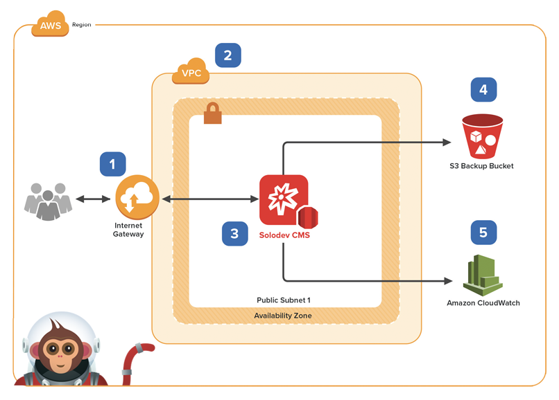
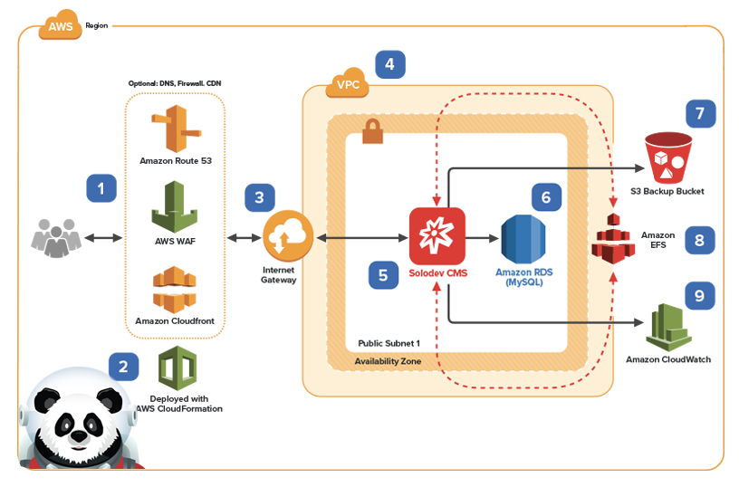
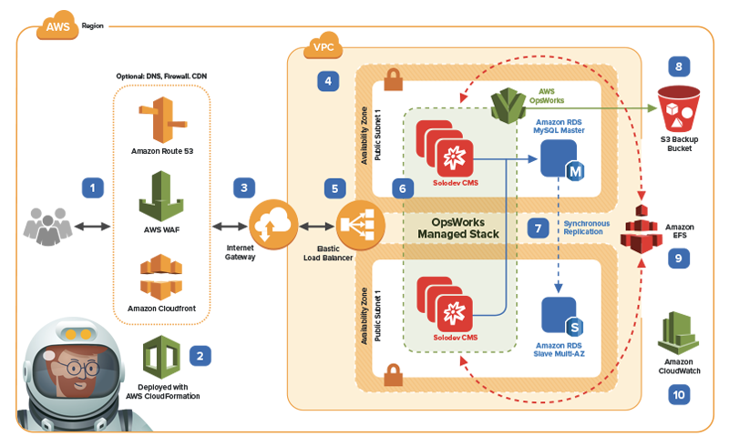

<b>Explore the outer limits of your digital universe with Solodev, The Web Experience Platform.</b> Solodev is the CMS for AWS. Built from the ground up to integrate with the full stack of AWS cloud technologies, Solodev WXP lets you build, launch, and manage amazing websites and engaging digital experiences – all with advanced, enterprise-level functionality and unparalleled levels of scalability, redundancy, and security. 

Whether you’re a designer, developer, or marketer, Solodev gives you the best of all worlds. You can take full command of your code or laser-focus on your content; the choice is yours. Create beautiful websites with total design freedom and responsive HTML. Develop powerful portals and data-driven applications with API integrations and custom PHP. Launch your most ambitious ideas with Solodev – available on-demand in the AWS Marketplace.

## Launch Options
To use Quick Launch links, first subscribe to <a href="https://aws.amazon.com/marketplace/pp/B01LXZKO21?qid=1534773581495&sr=0-1&ref_=srh_res_product_title">Solodev on the AWS Marketplace</a>
<table>
	<tr>
		<td width="50%"></td>
		<td><strong><a href="pages/solodev-cms-lite.md">Solodev WXP - Lite Edition</a></strong> The perfect launch pad for small development projects, Solodev Lite Edition gives you optimal control in a streamlined package. Pack your ship with best-of-breed CMS features, access to PHP, Apache, MySQL, and Mongo all on a single web server. Includes YAML templates for <a href="http://docs.aws.amazon.com/AmazonVPC/latest/UserGuide/VPC_Introduction.html">Amazon Virtual Private Cloud (VPC)</a>, <a href="http://docs.aws.amazon.com/AWSEC2/latest/UserGuide/concepts.html">Amazon Elastic Compute Cloud (EC2)</a>,  <a href="https://docs.aws.amazon.com/AmazonS3/latest/dev/Welcome.html">Amazon Simple Storage Service (S3)</a>, and <a href="https://docs.aws.amazon.com/AmazonCloudWatch/latest/monitoring/WhatIsCloudWatch.html">Amazon CloudWatch</a>.  <strong>Quick Launch:</strong> <a href="https://console.aws.amazon.com/cloudformation/home?region=us-east-1#/stacks/new?stackName=solodev-cms&templateURL=https://s3.amazonaws.com/solodev-aws-ha/aws/solodev-lite-single.yaml">(us-east-1)</a> 
		</td>
	</tr>
	<tr>
		<td width="50%"></td>
		<td><strong><a href="pages/solodev-cms-pro.md">Solodev WXP - Professional Edition</a></strong> Take command of your digital universe with the power of Solodev CMS, PHP, Apache, and Mongo on a single web server with an external RDS MySQL database. Includes YAML templates for <a href="http://docs.aws.amazon.com/AmazonVPC/latest/UserGuide/VPC_Introduction.html">Amazon Virtual Private Cloud (VPC)</a>, <a href="http://docs.aws.amazon.com/AWSEC2/latest/UserGuide/concepts.html">Amazon Elastic Compute Cloud (EC2)</a>,  <a href="http://docs.aws.amazon.com/AmazonRDS/latest/UserGuide/Welcome.html">Amazon Relational Database Service (RDS)</a>,  <a href="https://docs.aws.amazon.com/AmazonS3/latest/dev/Welcome.html">Amazon Simple Storage Service (S3)</a>, <a href="http://docs.aws.amazon.com/AmazonCloudFront/latest/DeveloperGuide/Introduction.html">Amazon CloudWatch</a>, <a href="http://docs.aws.amazon.com/Route53/latest/DeveloperGuide/Welcome.html">Amazon Route 53</a>, Amazon WAF and all deployed by <a href="http://docs.aws.amazon.com/AWSCloudFormation/latest/UserGuide/Welcome.html">AWS CloudFormation</a>.  <strong>Quick Launch:</strong> <a href="https://console.aws.amazon.com/cloudformation/home?region=us-east-1#/stacks/new?stackName=solodev-cms&templateURL=https://s3.amazonaws.com/solodev-aws-ha/aws/solodev-pro-single.yaml">(us-east-1)</a> </td>
	</tr>
	<tr>
		<td width="50%"></td>
		<td><strong><a href="pages/solodev-cms-enterprise-opsworks.md">Solodev WXP - Enterprise Edition (OpsWorks)</a></strong> Climb aboard the Solodev Enterprise and warp ahead with a highly available, fully redundant architecture managed by AWS OpsWorks. Includes YMAL templates for <a href="#">Amazon Virtual Private Cloud (VPC)</a> <a href="http://docs.aws.amazon.com/AWSEC2/latest/UserGuide/concepts.html">Amazon Elastic Compute Cloud (EC2)</a>, <a href="https://docs.aws.amazon.com/elasticloadbalancing/latest/application/introduction.html">Amazon Elastic Load Balancing (Application Load Balancer)</a>,  <a href="http://docs.aws.amazon.com/AmazonRDS/latest/UserGuide/Welcome.html">Amazon Relational Database Service (RDS)</a>,  <a href="http://docs.aws.amazon.com/efs/latest/ug/whatisefs.html">Amazon Elastic File System (EFS)</a>, <a href="https://docs.aws.amazon.com/AmazonS3/latest/dev/Welcome.html">Amazon Simple Storage Service (S3)</a>, <a href="http://docs.aws.amazon.com/AmazonCloudFront/latest/DeveloperGuide/Introduction.html">Amazon CloudWatch</a>, <a href="http://docs.aws.amazon.com/Route53/latest/DeveloperGuide/Welcome.html">Amazon Route 53</a>, <a href="https://docs.aws.amazon.com/acm/latest/userguide/acm-overview.html">Amazon Certificate Manager (ACM)</a>, Amazon WAF, all managed by <a href="https://docs.aws.amazon.com/opsworks/latest/userguide/welcome.html">Amazon OpsWorks</a>, deployed <a href="http://docs.aws.amazon.com/AWSCloudFormation/latest/UserGuide/Welcome.html">AWS CloudFormation</a>.  <strong>Quick Launch:</strong> <a href="https://console.aws.amazon.com/cloudformation/home?region=us-east-1#/stacks/new?stackName=solodev-cms&templateURL=https://s3.amazonaws.com/solodev-aws-ha/aws/solodev-enterprise-cluster.yaml">(us-east-1)</a> </td>
	</tr>
	<tr>
		<td width="50%"></td>
		<td><strong><a href="pages/solodev-cms-enterprise-autoscaling.md">Solodev WXP - Enterprise Edition (Auto Scaling Group)</a></strong> Expand your digital universe with the highest availability and redundancy managed by a combination of AWS Auto Scaling and Lambda. Includes YMAL templates for <a href="http://docs.aws.amazon.com/AmazonVPC/latest/UserGuide/VPC_Introduction.html
		">Amazon Virtual Private Cloud (VPC)</a>, <a href="http://docs.aws.amazon.com/AWSEC2/latest/UserGuide/concepts.html">Amazon Elastic Compute Cloud (EC2)</a>, <a href="https://docs.aws.amazon.com/elasticloadbalancing/latest/application/introduction.html">Amazon Elastic Load Balancing</a>,  <a href="http://docs.aws.amazon.com/AmazonRDS/latest/UserGuide/Welcome.html">Amazon Relational Database Service (RDS)</a>,  <a href="http://docs.aws.amazon.com/efs/latest/ug/whatisefs.html">Amazon Elastic File System (EFS)</a>, <a href="https://docs.aws.amazon.com/AmazonS3/latest/dev/Welcome.html">Amazon Simple Storage Service (S3)</a>, <a href="http://docs.aws.amazon.com/AmazonCloudFront/latest/DeveloperGuide/Introduction.html">Amazon CloudWatch</a>, <a href="http://docs.aws.amazon.com/Route53/latest/DeveloperGuide/Welcome.html">Amazon Route 53</a>, <a href="https://docs.aws.amazon.com/acm/latest/userguide/acm-overview.html">Amazon Certificate Manager (ACM)</a>, <a href="http://docs.aws.amazon.com/autoscaling/latest/userguide/WhatIsAutoScaling.html">Amazon WAF</a> managed by and deployed <a href="http://docs.aws.amazon.com/AWSCloudFormation/latest/UserGuide/Welcome.html">AWS CloudFormation</a>.</td>
	</tr>
</table>

## Solodev: The CMS for AWS
Built for the cloud – and built for the future. With Solodev and AWS, the possibilities are limitless. Now you can focus on your business, and not the infrastructure that powers it. Scale your capacity in seconds, and meet unexpected spikes in traffic without any downtime. Solodev and AWS give you the freedom to focus on your customers, and leave behind the heavy lifting of racking, stacking, and managing servers. 

As an AWS Advanced Technology Partner, Solodev delivers best-of-breed features, service, and support with rigorous competencies in key areas such as education, government, and marketing & commerce.

## Features
Enterprise-class software. World-class cloud hosting. Self-service and human support that’s out of this world. It’s all here with Solodev.

<table>
	<tr>
		<th width="415">Feature</th>
		<th>Lite</th>
		<th>Pro</th>
		<th>Enterprise</th>
	</tr>
	<tr>
		<td>Web Studio</td>
		<td></td>
		<td></td>
		<td></td>
	</tr>
	<tr>
		<td>Modules + Forms</td>
		<td></td>
		<td></td>
		<td></td>
	</tr>
	<tr>
		<td>Users + Permissions</td>
		<td></td>
		<td></td>
		<td></td>
	</tr>
	<tr>
		<td>Scheduling + Versioning</td>
		<td></td>
		<td></td>
		<td></td>
	</tr>
	<tr>
		<td>Landing Pages + Blog + Experiments</td>
		<td></td>
		<td></td>
		<td></td>
	</tr>
	<tr>
		<td>Staging Server</td>
		<td></td>
		<td></td>
		<td></td>
	</tr>
	<tr>
		<td>External Database</td>
		<td></td>
		<td></td>
		<td></td>
	</tr>
	<tr>
		<td>Load Balancing</td>
		<td></td>
		<td></td>
		<td></td>
	</tr>
	<tr>
		<td>Workflows</td>
		<td></td>
		<td></td>
		<td></td>
	</tr>
	<tr>
		<td>Integrations</td>
		<td></td>
		<td></td>
		<td></td>
	</tr>
	<tr>
		<td>Tasks</td>
		<td></td>
		<td></td>
		<td></td>
	</tr>
	<tr>
		<td>Theme Builder</td>
		<td></td>
		<td></td>
		<td></td>
	</tr>
	<tr>
		<td>API Access</td>
		<td></td>
		<td></td>
		<td></td>
	</tr>
</table>

## Case Studies
We’re launching our partners to new galaxies of digital success. Read how in our mission case studies. [View all case studies...](https://www.solodev.com/resources/case-studies/)

## Support
Houston, we have no problems… because Solodev has your back at every step, with 24x7x365 U.S. based human support. From our world-class HelpDesk, email support, phone access, or face-to-face training sessions, you’ve got the best team on the ground to get you to the stars. 

* Submit online support tickets
* Access dedicated support team members who know your business
* Benefit from in-depth product training from the Solodev Team

© ® 2018 Solodev. All rights reserved worldwide. And off planet. 

Errors or corrections? Email us at help@solodev.com.

---
Visit [solodev.com](https://www.solodev.com/) to learn more. 
