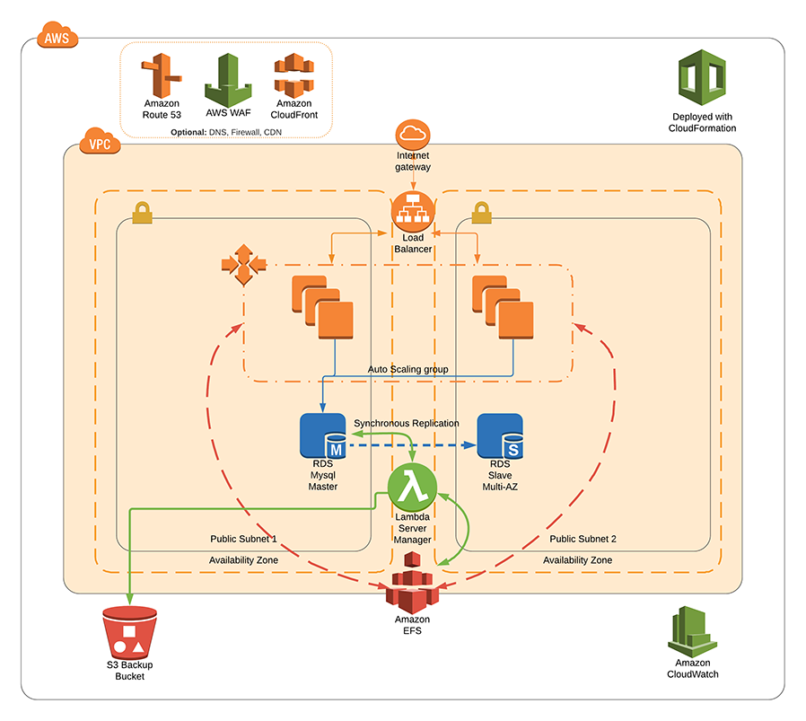

# Solodev Enterprise (AutoScalingGroup)
Launch your website to the next level with the proven power of the Solodev and the AWS Cloud. Now you can focus on managing your website – and not your hardware. With AWS, there’s no need to spend time and money maintaining servers and data centers. Deploy the Solodev CMS Enterprise Cluster to build a website that can handle virtually any amount of traffic, leverage mutliple geographic data centers for unmatched redundancy, and securely host your web experience.

## Overview
Solodev deployed on AWS uses a set of YAML templates including [Amazon Virtual Private Cloud (Amazon VPC)](http://docs.aws.amazon.com/AmazonVPC/latest/UserGuide/VPC_Introduction.html), [Amazon Elastic Compute Cloud (Amazon EC2)](http://docs.aws.amazon.com/AWSEC2/latest/UserGuide/concepts.html), [Auto Scaling](http://docs.aws.amazon.com/autoscaling/latest/userguide/WhatIsAutoScaling.html), [Elastic Load Balancing (Application Load Balancer)](https://docs.aws.amazon.com/elasticloadbalancing/latest/application/introduction.html), [Amazon Relational Database Service (Amazon RDS)](http://docs.aws.amazon.com/AmazonRDS/latest/UserGuide/Welcome.html), [Amazon ElastiCache](http://docs.aws.amazon.com/AmazonElastiCache/latest/UserGuide/WhatIs.html), [Amazon Elastic File System (Amazon EFS)](http://docs.aws.amazon.com/efs/latest/ug/whatisefs.html), [Amazon CloudFront](http://docs.aws.amazon.com/AmazonCloudFront/latest/DeveloperGuide/Introduction.html), [Amazon Route 53](http://docs.aws.amazon.com/Route53/latest/DeveloperGuide/Welcome.html), [Amazon Certificate Manager (Amazon ACM)](https://docs.aws.amazon.com/opsworks/latest/userguide/welcome.html)  with [AWS CloudFormation](http://docs.aws.amazon.com/AWSCloudFormation/latest/UserGuide/Welcome.html).

## Prerequisites
Lorem ipsum dolor sit amet, consectetur adipiscing elit, sed do eiusmod tempor incididunt ut labore et dolore magna aliqua. Ut enim ad minim veniam, quis nostrud exercitation ullamco laboris nisi ut aliquip ex ea commodo consequat.

Duis aute irure dolor in reprehenderit in voluptate velit esse cillum dolore eu fugiat nulla pariatur. Excepteur sint occaecat cupidatat non proident, sunt in culpa qui officia deserunt mollit anim id est laborum.

## Steps to Run
To launch the entire stack and deploy on AWS, click on one of the ***Launch Stack*** links below.

You can launch this CloudFormation stack, using your account, in the following AWS Regions:

AWS Region Code             | Name                       | Launch 
----------------------------|----------------------------|:-------------------------:
us-east-1                   | US East (N. Virginia)      | 
us-east-2                   | US East (Ohio)             | 
us-west-1                   | US West (N. California)    | 
us-west-2                   | US West (Oregon)           | 
eu-west-1                   | EU (Ireland)               | 
eu-west-2                   | EU (London)                | 
eu-central-1                | EU (Frankfurt)             | 
ca-central-1                | Canada (Central)           | 

The above links will launch the "Select Template" wizard with the master template preselected. Click "Next" to customize the launch parameters.

## Parameters

Parameter                             | Description
------------------------------------- | ---------------------
Stack name     				          | The name of your stack
**Network Configuration**     		  | 
Which VPC should this be deployed to? | Choose which VPC the Application should be deployed to
Subnets     						  | Choose at least two public subnets for this application
(Optional) FQDN                       | URL for app. FQDN must be pointed to CNAME of ALB.
(Optional) CertficateArn              | SSL cert for HTTPS listener that matches the FQDN above
**Server Configuration**              | 
InstanceType                          | EC2 instance type
KeyName                               | Name of an existing EC2 KeyPair to enable SSH access to the instances
**Solodev Configuration**             | 
AdminUser                             | CMS Admin User
AdminPassword                         | The solodev admin account password
DatabasePassword                      | The database root account password
DevOpsFlavor                          | Which DevOps tools would you like to use to manage auto scaling
RestoreBucketName                     | Name of bucket containing files for restore
AMI                                   | Build AMI - Please leave this blank unless told otherwise

## FAQs
1. Lorem ipsum dolor sit amet?
> Excepteur sint occaecat cupidatat non proident, sunt in culpa qui officia deserunt mollit anim id est laborum.

2. Lorem ipsum dolor sit amet?
> Excepteur sint occaecat cupidatat non proident, sunt in culpa qui officia deserunt mollit anim id est laborum.

3. Lorem ipsum dolor sit amet?
> Excepteur sint occaecat cupidatat non proident, sunt in culpa qui officia deserunt mollit anim id est laborum.

---
© 2018 Solodev. All rights reserved. 

Errors or corrections? Email us at help@solodev.com.

---
Visit [solodev.com](https://www.solodev.com/) to learn more. 

