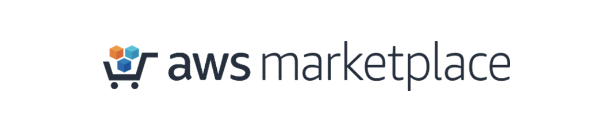

# Solodev CMS Enterprise Edition for Docker
Get ready to dock with the space-age power of containers! Launch your next amazing website, application, or dream project today with the self-service enterprise power of Solodev – built exclusively for AWS with fully containerized orchestration for Docker. With containers, you can reach new levels of productivity and management, allowing you to run and scale at will. Now you can focus on building, deploying, and managing your applications, and not the underlying infrastructure.

## Overview
Solodev CMS Enterprise Edition for Docker on AWS uses a set of YAML templates including [Amazon Virtual Private Cloud (VPC)](http://docs.aws.amazon.com/AmazonVPC/latest/UserGuide/VPC_Introduction.html), [Amazon Elastic Compute Cloud (EC2)](http://docs.aws.amazon.com/AWSEC2/latest/UserGuide/concepts.html), [Amazon Elastic Load Balancing (Application Load Balancer)](https://docs.aws.amazon.com/elasticloadbalancing/latest/application/introduction.html), [Amazon Relational Database Service (RDS)](http://docs.aws.amazon.com/AmazonRDS/latest/UserGuide/Welcome.html), [Amazon Elastic File System (EFS)](http://docs.aws.amazon.com/efs/latest/ug/whatisefs.html), [Amazon Simple Storage Service (S3)](https://docs.aws.amazon.com/AmazonS3/latest/dev/Welcome.html), [Amazon CloudWatch](https://docs.aws.amazon.com/AmazonCloudWatch/latest/monitoring/WhatIsCloudWatch.html), [Amazon CloudFront](http://docs.aws.amazon.com/AmazonCloudFront/latest/DeveloperGuide/Introduction.html), [Amazon Route 53](http://docs.aws.amazon.com/Route53/latest/DeveloperGuide/Welcome.html), [Amazon Certificate Manager (ACM)](https://docs.aws.amazon.com/acm/latest/userguide/acm-overview.html), [Amazon Web Application Firewall (WAF)](https://docs.aws.amazon.com/waf/latest/developerguide/what-is-aws-waf.html) managed by [Amazon ECS](https://docs.aws.amazon.com/AmazonECS/latest/developerguide/docker-basics.html) and deployed by [AWS CloudFormation](http://docs.aws.amazon.com/AWSCloudFormation/latest/UserGuide/Welcome.html).

Getting to the Solodev Launchpad is easy. In just a few short steps, you'll be lifting off on AWS.

## Step 1: Subscribe on the AWS Marketplace

Solodev is a professionally managed, enterprise-class Digital Customer Experience Platform and content management system (CMS). Before launching one of our products, you'll first need to subscribe to Solodev on the <a href="https://aws.amazon.com/marketplace/pp/B07K6TRSMP/ref=_ptnr_solodev_github_B07K6TRSMP">AWS Marketplace.</a> Click the button below to get started: 
<table>
	<tr>
		<td width="60%"></td>
		<td></td>
	</tr>
</table>

Already have a Solodev license? Call <a href="tel:1.800.859.7656">1-800-859-7656</a> and we’ll activate your subscription for you.  

## Step 2: Configure Your VPC and EC2 Key Pair
Please note that both a <a href="http://docs.aws.amazon.com/AmazonVPC/latest/UserGuide/VPC_Introduction.html">VPC</a> and <a href="http://docs.aws.amazon.com/AWSEC2/latest/UserGuide/concepts.html">EC2 Key Pair</a> must be configured within the region you intend to launch your stack. If the following items are already created, you can skip directly to launch.  

## Step 3: Launch your CloudFormation Stack
Once you’ve configured your <a href="http://docs.aws.amazon.com/AmazonVPC/latest/UserGuide/VPC_Introduction.html">VPC</a> and <a href="http://docs.aws.amazon.com/AWSEC2/latest/UserGuide/concepts.html">EC2 Key Pair</a>, you can launch your CloudFormation stack. Select the AWS region of your choice below:

<strong>Confirm Subscription</strong> 
Click on the "Continue to Subscribe" link within the AWS Marketplace listing. Once your subscription is processed, you will see confirmation and the "Continue to Configuration" button.

<table>
	<tr>
		<td></td>
	</tr>
</table>

<strong>Configure Solodev CMS Enterprise Edition for Docker</strong> 
Specify the basic configurables such as the software version. Click on the "Continue to Launch" button to proceed.

<table>
	<tr>
		<td></td>
	</tr>
</table>

<strong>Launch Solodev CMS Enterprise Edition for Docker</strong> 
Confirm your configurations and Click on the "Launch Solodev CMS" link to continue to CloudFormation.

<table>
	<tr>
		<td></td>
	</tr>
</table>

## Step 4: Fill Out the CloudFormation Stack Wizard
<strong>Continue with the preselected CloudFormation Template</strong> 
The Amazon S3 template URL (used for the CloudFormation configuration) should be preselected. Click "Next" to continue.

<table>
	<tr>
		<td></td>
	</tr>
</table>

<strong>Specify Details</strong> 
The following parameters must be configured to launch your Solodev CMS CloudFormation stack:

<table>
	<tr>
		<td></td>
	</tr>
</table>

<table>
	<tr>
		<th width="33%"><strong>Parameter</strong></th>
		<th width="600px"><strong>Description</strong></th>
	</tr>
	<tr>
		<td>Stack name</td>
		<td>The name of your stack (set to "solodev-ecs" by default). Please note, the name must be all lowercase.</td>
	</tr>
</table>

<table>
	<tr>
		<td colspan="2"><strong>Network Setup</strong></td>
	</tr>
	<tr>
		<td width="33%">VPCID</td>
		<td width="600px">Choose which VPC the application should be deployed to</td>
	</tr>
	<tr>
		<td>Subnets</td>
		<td>Choose at least two public subnets for this application</td>
	</tr>
	<tr>
		<td>InstanceType</td>
		<td>The EC2 instance type you wish to launch</td>
	</tr>
	<tr>
		<td>InstanceCount</td>
		<td>Number of instances behind load balancer. Minimum 2 required for high availability.</td>
	</tr>	
	<tr>
		<td>KeyName</td>
		<td>Name of an existing EC2 KeyPair to enable SSH access to the instances</td>
	</tr>
</table>

<table>
	<tr>
		<td colspan="2"><strong>CMS Settings</strong></td>
	<tr>
		<td width="33%">AdminUser</td>
		<td width="600px">The solodev admin username</td>
	</tr>
	<tr>
		<td>AdminPassword</td>
		<td>The solodev admin password</td>
	</tr>
	<tr>
		<td>DatabaseName</td>
		<td>The solodev database name</td>
	</tr>	
	<tr>
		<td>DatabasePassword</td>
		<td>The database root password</td>
	</tr>
	<tr>
		<td>StorageEncrypted</td>
		<td>Enable encryption for both Database (RDS) and Filesystem (EFS). True or False.</td>
	</tr>
</table>

<table>
	<tr>
		<td colspan="2"><strong>Optional: SSL Configuration</strong></td>
	</tr>
	<tr>
		<td width="33%">FQDN</td>
		<td width="600px">URL for app. FQDN must be pointed to CNAME of ALB.</td>
	</tr>	
	<tr>
		<td>CertificateArn</td>
		<td>CertificateArn for SSL cert that matches the FQDN above. Please visit the AWS Certificate Manager.</td>
	</tr>
</table>

<table>
	<tr>
		<td colspan="2"><strong>Optional: Advanced</strong></td>
	</tr>
	<tr>
		<td width="33%">RestoreBucketName</td>
		<td width="600px">Name of S3 bucket containing files for restore</td>
	</tr>	
	<tr>
		<td>DeletionPolicy</td>
		<td>Experimental: Deletion Policy (Retain, Delete, Snapshot)</td>
	</tr>
</table>

<strong>Specify Options</strong> 
Generally speaking, no additional options need to be configured. If you are experiencing continued problems installing the software, disable "Rollback on failure" under the "Advanced" options. This will allow for further troubleshooting if necessary. Click on the "Next" button to continue.

<table>
	<tr>
		<td></td>
	</tr>
</table>

<strong>Review</strong> 
Review all CloudFront details and options. Ensure that the "I acknowledge that AWS CloudFormation might create IAM resources with custom names" checkbox is selected as well as the "I acknowledge that AWS CloudFormation might require the following capability: CAPABILITY_AUTO_EXPAND" checkbox. Click on the "Create" button to launch your stack.

<table>
	<tr>
		<td></td>
	</tr>
</table>

## Step 5: Monitor the CloudFormation Stack Creation Process
Upon launching your CloudFormation stack, you will be able to monitor the installation logs under the "Events" tab. The CloudFormation template will launch several stacks related to your Solodev instance including EFS, ECS, and RDS. If you encounter any failures during this time, please visit the <a href="https://github.com/solodev/AWS-Launch-Pad/wiki/Common-Issues">Common Issues</a> page to begin troubleshooting.

<table>
	<tr>
		<td></td>
	</tr>
</table>

## Step 6: View CloudFormation Stack Outputs

If your stack builds successfully, you will see the green "CREATE_COMPLETE" message. Click on the primary stack and view the "Outputs" tab. You will find the load balancer URL for the Solodev backend. Point both your primary domain (mydomain.com) and a dedicated backend domain/subdomain (solodev.mydomain.com) to this URL.

<table>
	<tr>
		<td></td>
	</tr>
</table>

<table>
	<tr>
		<td></td>
	</tr>
</table>

## Step 7: Login to Solodev

Visit either the load balancer URL or the backend domain you configured in Step 7. Log-in to Solodev using the username "solodev" and the password you configured in Step 5.

<table>
	<tr>
		<td></td>
	</tr>
</table>

## Support
Houston, we have no problems… because Solodev Customer Care has your back at every step! From our world-class HelpDesk to our focused training sessions, you’ve got the best team on the ground to get you to the stars. 

Solodev Customer Care Includes
* 24x7x365 U.S. based human support
* Online HelpDesk ticketing
* Phone and email support
* Live training courses
* Over 300 pages of searchable documentation and tutorials

To learn more about our add-on support options, call 1-800-859-7656 to speak with one of our Solodev Customer Care Specialists.

## Developers
Are you a Solodev Developer? Launch a development stack in your AWS account using the below links. Please note, the builds will only be successfull for authorized Solodev Developers.
* <a href="https://console.aws.amazon.com/cloudformation/home?region=us-east-1#/stacks/new?stackName=solodev-docker&templateURL=https://s3.amazonaws.com/solodev-cms/cloudformation/solodev-enterprise-ecs.yaml">Launch Solodev ECS</a>
* <a href="https://console.aws.amazon.com/cloudformation/home?region=us-east-1#/stacks/new?stackName=solodev-docker-dev&templateURL=https://s3.amazonaws.com/solodev-cms/cloudformation/solodev-enterprise-ecs.yaml">Launch Solodev ECS (DEV)</a>

## Need Help?

Solodev is a professionally managed, enterprise-class solution, and our team of certified engineers are here to support your success. While our self-serve options are easy to launch, you’ve always got a co-pilot at the helm. If you have any questions – or if you already have a Solodev license and need support with your AWS subscription – call <a href="tel:1.800.859.7656">1-800-859-7656</a> and we’ll help you get to the launchpad.

© 2019 Solodev. All rights reserved worldwide. And off planet. 

Errors or corrections? Email us at help@solodev.com.

---
Visit [solodev.com](https://www.solodev.com/) to learn more. 
