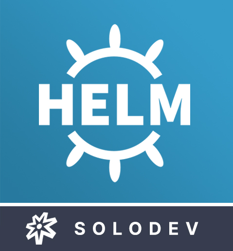
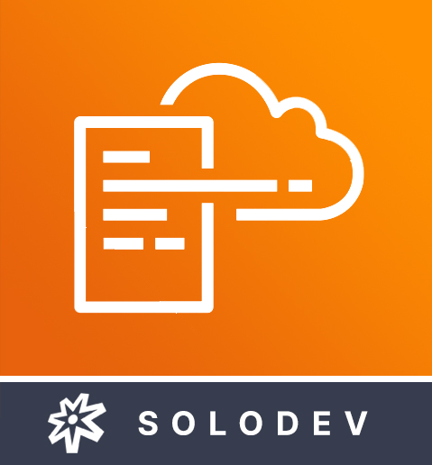

# Solodev DCX Enterprise Edition for Kubernetes
Designed for enterprise-level demands, Solodev DCX Enterprise Edition for Kubernetes gives you best-of-breed features and advanced capabilities on a secure archtiecture managed by Amazon EKS. Launch Solodev DCX in a new EKS cluster or even deploy to an existing cluster.

## Overview
Solodev DCX Enterprise Edition for Kubernetes on AWS empowers you to run and scale at will - so you can focus on building, deploying, and managing your applications and not the underlying infrastructure.

## Step 1: Subscribe on the AWS Marketplace
Solodev is a professionally managed, enterprise-class Digital Customer Experience Platform and content management system (CMS). Before launching one of our products, you'll first need to subscribe to Solodev on the <a href="https://aws.amazon.com/marketplace/pp/B07XV951M6">AWS Marketplace.</a> Click the button below to get started: 
<table>
	<tr>
		<td width="60%"></td>
		<td></td>
	</tr>
</table>

Already have a Solodev license? Call <a href="tel:1.800.859.7656">1-800-859-7656</a> and we’ll activate your subscription for you.  

## Step 2: Choose Deployment Option
How you deploy Solodev DCX Enterprise Edition for Kubernetes depends upon your experience, comfort level with deployment technologies, and existing infrastructure. Comfortable with Helm and command line? Visit the <a href="https://github.com/techcto/charts">Solodev Helm Charts</a> repository for instructions on deploying to new or existing clusters with Helm commands. Prefer a streamlined experience? With just a few configurables, you can <a href="pages/deploy-via-cloudformation.md">deploy Solodev DCX by CloudFormation</a> and have everything in a managed stack.

<table>
	<tr>
		<td width="25%"></td>
		<td>
			<h3>Deploy via Helm Charts</h3>
			
For those looking to install Solodev DCX to a new or existing Kubernetes cluster via Helm and command line, visit the Solodev Helm Charts repository for further instructions.

			

		</td>
	</tr>
</table>

<table>
	<tr>
		<td width="25%"></td>
		<td>
			<h3>Deploy via CloudFormation</h3>
			
Launch a new EKS cluster and deploy Solodev DCX via AWS CloudFormation. By following the configuration instructions, you will be able to have your stacks created in no time.

			

		</td>
	</tr>
</table>

## Support
Houston, we have no problems… because Solodev Customer Care has your back at every step! From our world-class HelpDesk to our focused training sessions, you’ve got the best team on the ground to get you to the stars. 

Solodev Customer Care Includes
* 24x7x365 U.S. based human support
* Online HelpDesk ticketing
* Phone and email support
* Live training courses
* Over 300 pages of searchable documentation and tutorials

To learn more about our add-on support options, call 1-800-859-7656 to speak with one of our Solodev Customer Care Specialists.

## Need Help?
Solodev is a professionally managed, enterprise-class solution, and our team of certified engineers are here to support your success. While our self-serve options are easy to launch, you’ve always got a co-pilot at the helm. If you have any questions – or if you already have a Solodev license and need support with your AWS subscription – call <a href="tel:1.800.859.7656">1-800-859-7656</a> and we’ll help you get to the launchpad.

---
© 2019 Solodev. All rights reserved worldwide. And off planet. 

Errors or corrections? Email us at help@solodev.com.

---
Visit [solodev.com](https://www.solodev.com/) to learn more. 
