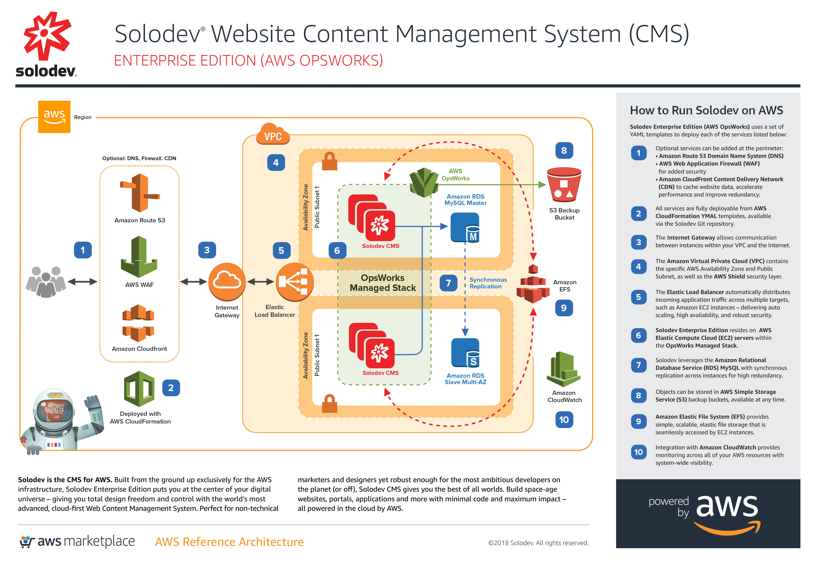



# Solodev CMS Enterprise Edition for AWS OpsWorks
Climb aboard the Solodev Enterprise and warp speed ahead with a highly available, full redundant archiecture managed by AWS OpsWorks. With AWS, there's no need to spend time and money maintaining servers and data centers. Quickly and easily deploy Solodev Enterprise to build a website, portal, or applications that can handle virtually any amount of traffic, leveraging multiple geographic data centers for unmatched redundancy, security, and scalability. All available on-demand in the <a href="https://aws.amazon.com/marketplace/pp/B01LXZKO21?qid=1534773581495&sr=0-1&ref_=srh_res_product_title">AWS Marketplace</a>.

## Overview
Solodev CMS Enterprise Edition for AWS OpsWorks on AWS uses a set of YAML templates including [Amazon Virtual Private Cloud (VPC)](http://docs.aws.amazon.com/AmazonVPC/latest/UserGuide/VPC_Introduction.html), [Amazon Elastic Compute Cloud (EC2)](http://docs.aws.amazon.com/AWSEC2/latest/UserGuide/concepts.html), [Amazon Elastic Load Balancing (Application Load Balancer)](https://docs.aws.amazon.com/elasticloadbalancing/latest/application/introduction.html), [Amazon Relational Database Service (RDS)](http://docs.aws.amazon.com/AmazonRDS/latest/UserGuide/Welcome.html), [Amazon Elastic File System (EFS)](http://docs.aws.amazon.com/efs/latest/ug/whatisefs.html), [Amazon Simple Storage Service (S3)](https://docs.aws.amazon.com/AmazonS3/latest/dev/Welcome.html), [Amazon CloudWatch](https://docs.aws.amazon.com/AmazonCloudWatch/latest/monitoring/WhatIsCloudWatch.html), [Amazon CloudFront](http://docs.aws.amazon.com/AmazonCloudFront/latest/DeveloperGuide/Introduction.html), [Amazon Route 53](http://docs.aws.amazon.com/Route53/latest/DeveloperGuide/Welcome.html), [Amazon Certificate Manager (ACM)](https://docs.aws.amazon.com/acm/latest/userguide/acm-overview.html), [Amazon Web Application Firewall (WAF)](https://docs.aws.amazon.com/waf/latest/developerguide/what-is-aws-waf.html) managed by [Amazon OpsWorks](https://docs.aws.amazon.com/opsworks/latest/userguide/welcome.html) and deployed by [AWS CloudFormation](http://docs.aws.amazon.com/AWSCloudFormation/latest/UserGuide/Welcome.html).

Getting to the Solodev Launchpad is easy. In just a few short steps, you'll be lifting off on AWS.

## Step 1: Subscribe on the AWS Marketplace

Solodev is a professionally managed, enterprise-class Content Management System (CMS). Before launching one of our products, you'll first need to subscribe to Solodev on the <a href="https://aws.amazon.com/marketplace/pp/B01LXZKO21?qid=1534773581495&sr=0-1&ref_=srh_res_product_title">AWS Marketplace.</a> Click the button below to get started: 
<table>
	<tr>
		<td width="60%"></td>
		<td></td>
	</tr>
</table>

Already have a Solodev license? Call <a href="tel:1.800.859.7656">1-800-859-7656</a> and we’ll activate your subscription for you.  

## Step 2: Configure Your VPC and EC2 Key Pair
Please note that both a <a href="http://docs.aws.amazon.com/AmazonVPC/latest/UserGuide/VPC_Introduction.html">VPC</a> and <a href="http://docs.aws.amazon.com/AWSEC2/latest/UserGuide/concepts.html">EC2 Key Pair</a> must be configured within the region you intend to launch your stack. If the following items are already created, you can skip directly to launch.  

## Step 3: Launch your CloudFormation Stack
Once you’ve configured your <a href="http://docs.aws.amazon.com/AmazonVPC/latest/UserGuide/VPC_Introduction.html">VPC</a> and <a href="http://docs.aws.amazon.com/AWSEC2/latest/UserGuide/concepts.html">EC2 Key Pair</a>, you can launch your CloudFormation stack. Select the AWS region of your choice below:  

<table>
	<tr>
		<th width="299">AWS Region Code</td>
		<th width="299">Name</td>
		<th width="299" align="center">Launch</td>
	</tr>
	<tr>
		<td>us-east-1</td>
		<td>US East (N. Virginia)</td>
		<td align="center"><a href="https://console.aws.amazon.com/cloudformation/home?region=us-east-1#/stacks/new?stackName=solodev-cms-opsworks&templateURL=https://s3.amazonaws.com/solodev-aws-ha/aws/solodev-enterprise-opsworks.yaml"></td>
	</tr>
	<tr>
		<td>us-east-2</td>
		<td>US East (Ohio)</td>
		<td align="center"><!-- <a href="#">--></td>
	</tr>
	<tr>
		<td>us-west-1</td>
		<td>US West (N. California)</td>
		<td align="center"><a href="https://console.aws.amazon.com/cloudformation/home?region=us-west-1#/stacks/new?stackName=solodev-cms-opsworks&templateURL=https://s3.amazonaws.com/solodev-aws-ha/aws/solodev-enterprise-opsworks.yaml"></td>
	</tr>
	<tr>
		<td>us-west-2</td>
		<td>US West (Oregon)</td>
		<td align="center"><a href="https://console.aws.amazon.com/cloudformation/home?region=us-west-2#/stacks/new?stackName=solodev-cms-opsworks&templateURL=https://s3.amazonaws.com/solodev-aws-ha/aws/solodev-enterprise-opsworks.yaml"></td>
	</tr>
	<tr>
		<td>eu-west-1</td>
		<td>EU (Ireland)</td>
		<td align="center"><!-- <a href="#">--></td>
	</tr>
	<tr>
		<td>eu-west-2</td>
		<td>EU (London)</td>
		<td align="center"><!-- <a href="#">--></td>
	</tr>
	<tr>
		<td>eu-central-1</td>
		<td>EU (Frankfurt)</td>
		<td align="center"><!-- <a href="#">--></td>
	</tr>
	<tr>
		<td>eu-central-2</td>
		<td>Canada (Central)</td>
		<td align="center"><!-- <a href="#">--></td>
	</tr>
</table>
The above links will launch the "Select Template" wizard, with the master template preselected. Click the "Next" button to customize the launch parameters.

## Parameters

The following parameters must be configured to launch your Solodev CMS CloudFormation stack:

<table>
	<tr>
		<th width="33%"><strong>Parameter</strong></th>
		<th width="600px"><strong>Description</strong></th>
	</tr>
	<tr>
		<td>Stack name</td>
		<td>The name of your stack (set to "solodev-cms-opsworks" by default). Please note, the name must be all lowercase.</td>
	</tr>
</table>

<table>
	<tr>
		<td colspan="2"><strong>Network Setup</strong></td>
	</tr>
	<tr>
		<td width="33%">VPCID</td>
		<td width="600px">Choose which VPC the application should be deployed to</td>
	</tr>
	<tr>
		<td>Subnets</td>
		<td>Choose at least two public subnets for this application</td>
	</tr>
	<tr>
		<td>InstanceType</td>
		<td>The EC2 instance type you wish to launch</td>
	</tr>
	<tr>
		<td>InstanceCount</td>
		<td>Number of instances behind load balancer. Minimum 2 required for high availability.</td>
	</tr>	
	<tr>
		<td>KeyName</td>
		<td>Name of an existing EC2 KeyPair to enable SSH access to the instances</td>
	</tr>
</table>

<table>
	<tr>
		<td colspan="2"><strong>CMS Settings</strong></td>
	<tr>
		<td width="33%">AdminUser</td>
		<td width="600px">The solodev admin username</td>
	</tr>
	<tr>
		<td>AdminPassword</td>
		<td>The solodev admin password</td>
	</tr>
	<tr>
		<td>DatabasePassword</td>
		<td>The database root password</td>
	</tr>
	<tr>
		<td>StorageEncrypted</td>
		<td>Enable encryption for both Database (RDS) and Filesystem (EFS). True or False.</td>
	</tr>
</table>

<table>
	<tr>
		<td colspan="2"><strong>Optional: SSL Configuration</strong></td>
	</tr>
	<tr>
		<td width="33%">FQDN</td>
		<td width="600px">URL for app. FQDN must be pointed to CNAME of ALB.</td>
	</tr>	
	<tr>
		<td>CertificateArn</td>
		<td>CertificateArn for SSL cert that matches the FQDN above. Please visit the AWS Certificate Manager.</td>
	</tr>
</table>

<table>
	<tr>
		<td colspan="2"><strong>Optional: Advanced</strong></td>
	</tr>
	<tr>
		<td width="33%">RestoreBucketName</td>
		<td width="600px">Name of S3 bucket containing files for restore</td>
	</tr>	
	<tr>
		<td>CookbookURL</td>
		<td>https://s3.amazonaws.com/solodev-aws-ha/cookbooks.tar.gz | Download and host on your own S3 bucket or copy this URL.</td>
	</tr>
	<tr>
		<td>DeletionPolicy</td>
		<td>Experimental: Deletion Policy (Retain, Delete, Snapshot)</td>
	</tr>
</table>

## Support
Houston, we have no problems… because Solodev Customer Care has your back at every step! From our world-class HelpDesk to our focused training sessions, you’ve got the best team on the ground to get you to the stars. 

Solodev Customer Care Includes
* 24x7x365 U.S. based human support
* Online HelpDesk ticketing
* Phone and email support
* Live training courses
* Over 600 pages of searchable documentation and tutorials

To learn more about our add-on support options, call 1-800-859-7656 to speak with one of our Solodev Customer Care Specialists.

## Need Help?

Solodev is a professionally managed, enterprise-class solution, and our team of certified engineers are here to support your success. While our self-serve options are easy to launch, you’ve always got a co-pilot at the helm. If you have any questions – or if you already have a Solodev license and need support with your AWS subscription – call <a href="tel:1.800.859.7656">1-800-859-7656</a> and we’ll help you get to the launchpad.

© 2018 Solodev. All rights reserved worldwide. And off planet. 

Errors or corrections? Email us at help@solodev.com.

---
Visit [solodev.com](https://www.solodev.com/) to learn more. 
