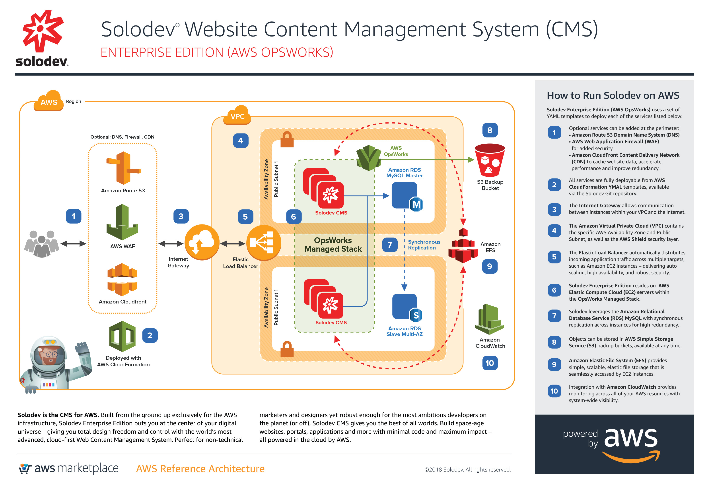
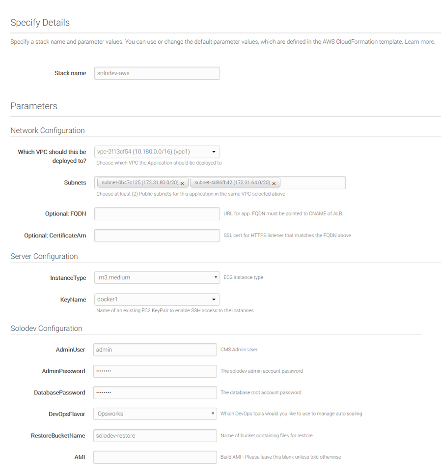

# Solodev Enterprise (OpsWorks)
Launch your website to the next level with the proven power of the Solodev and the AWS Cloud. Now you can focus on managing your website – and not your hardware. With AWS, there’s no need to spend time and money maintaining servers and data centers. Deploy Solodev Enterprise (Opsworks) to build a website that can handle virtually any amount of traffic, leverage mutliple geographic data centers for unmatched redundancy, and securely host your web experience.

## Overview
Solodev Enterprise (OpsWorks) on AWS uses a set of YAML templates including [Amazon Virtual Private Cloud (VPC)](http://docs.aws.amazon.com/AmazonVPC/latest/UserGuide/VPC_Introduction.html), [Amazon Elastic Compute Cloud (EC2)](http://docs.aws.amazon.com/AWSEC2/latest/UserGuide/concepts.html), [Amazon Elastic Load Balancing (Application Load Balancer)](https://docs.aws.amazon.com/elasticloadbalancing/latest/application/introduction.html), [Amazon Relational Database Service (RDS)](http://docs.aws.amazon.com/AmazonRDS/latest/UserGuide/Welcome.html), [Amazon Elastic File System (EFS)](http://docs.aws.amazon.com/efs/latest/ug/whatisefs.html), [Amazon Simple Storage Service (S3)](https://docs.aws.amazon.com/AmazonS3/latest/dev/Welcome.html), [Amazon CloudWatch](https://docs.aws.amazon.com/AmazonCloudWatch/latest/monitoring/WhatIsCloudWatch.html), [Amazon CloudFront](http://docs.aws.amazon.com/AmazonCloudFront/latest/DeveloperGuide/Introduction.html), [Amazon Route 53](http://docs.aws.amazon.com/Route53/latest/DeveloperGuide/Welcome.html), [Amazon Certificate Manager (ACM)](https://docs.aws.amazon.com/acm/latest/userguide/acm-overview.html), [Amazon Web Application Firewall (WAF)](https://docs.aws.amazon.com/waf/latest/developerguide/what-is-aws-waf.html) managed by [Amazon OpsWorks](https://docs.aws.amazon.com/opsworks/latest/userguide/welcome.html) and deployed by [AWS CloudFormation](http://docs.aws.amazon.com/AWSCloudFormation/latest/UserGuide/Welcome.html).

## Prerequisites
To launch Solodev Enterprise (OpsWorks), you must first "Subscribe" to Solodev on the AWS Marketplace
1. Visit <a href="https://aws.amazon.com/marketplace/pp/B01LXZKO21?qid=1534773581495&sr=0-1&ref_=srh_res_product_title">Solodev on the AWS Marketplace</a>
2. Click on the "Continue to Subscribe" button
3. Click the "Subscribe" button
3. Return to this page and use one of the "Launch" buttons below

Please note that both a <a href="https://console.aws.amazon.com/vpc/home?region=us-east-1#vpcs:">VPC</a> and an <a href="https://console.aws.amazon.com/ec2/v2/home?region=us-east-1#KeyPairs:sort=keyName">EC2 Key Pair</a> must be configured within the region you intend to launch the stack. If the following items are already created, you can skip to launch.

## Steps to Run
To launch the entire stack and deploy on AWS, click on one of the ***Launch Stack*** links below.

You can launch this CloudFormation stack, using your account, in the following AWS Regions:

<table>
	<tr>
		<th width="299">AWS Region Code</td>
		<th width="299">Name</td>
		<th width="299" align="center">Launch</td>
	</tr>
	<tr>
		<td>us-east-1</td>
		<td>US East (N. Virginia)</td>
		<td align="center"><a href="https://console.aws.amazon.com/cloudformation/home?region=us-east-1#/stacks/new?stackName=solodev-cms&templateURL=https://s3.amazonaws.com/solodev-aws-ha/aws/solodev-enterprise-cluster.yaml"></td>
	</tr>
	<tr>
		<td>us-east-2</td>
		<td>US East (Ohio)</td>
		<td align="center"><a href="#"></td>
	</tr>
	<tr>
		<td>us-west-1</td>
		<td>US West (N. California)</td>
		<td align="center"><a href="#"></td>
	</tr>
	<tr>
		<td>us-west-2</td>
		<td>US West (Oregon)</td>
		<td align="center"><a href="#"></td>
	</tr>
	<tr>
		<td>eu-west-1</td>
		<td>EU (Ireland)</td>
		<td align="center"><a href="#"></td>
	</tr>
	<tr>
		<td>eu-west-2</td>
		<td>EU (London)</td>
		<td align="center"><a href="#"></td>
	</tr>
	<tr>
		<td>eu-central-1</td>
		<td>EU (Frankfurt)</td>
		<td align="center"><a href="#"></td>
	</tr>
	<tr>
		<td>eu-central-2</td>
		<td>Canada (Central)</td>
		<td align="center"><a href="#"></td>
	</tr>
</table>

The above links will launch the "Select Template" wizard with the master template preselected. Click the "Next" button to customize the launch parameters.

## Parameters

<table>
	<tr>
		<th width="300">Parameter</th>
		<th width="598">Description</th>
	</tr>
	<tr>
		<td>Stack name</td>
		<td> The name of your stack (set to "solodev-cms" by default)</td>
	</tr>
	<tr>
		<td colspan="2"><strong>--- Network Configuration ---</strong></td>
	</tr>
	<tr>
		<td>Which VPC should this be deployed to?</td>
		<td>Select which VPC the application should be deployed to</td>
	</tr>
	<tr>
		<td>Subnets</td>
		<td>Select at least two public subnets for this application</td>
	</tr>
	<tr>
		<td>(Optional) FQDN</td>
		<td>URL for app. FQDN must be pointed to CNAME of ALB.</td>
	</tr>
	<tr>
		<td>(Optional) CertficateArn</td>
		<td>SSL cert for HTTPS listener that matches the FQDN above</td>
	</tr>
	<tr>
		<td colspan="2"><strong>--- Server Configuration ---</strong></td>
	</tr>
	<tr>
		<td>InstanceType</td>
		<td>EC2 instance type</td>
	</tr>
	<tr>
		<td>KeyName </td>
		<td>Name of an existing EC2 KeyPair to enable SSH access to the instances</td>
	</tr>
	<tr>
		<td colspan="2"><strong>--- Solodev Configuration ---</strong></td>
	</tr>
	<tr>
		<td>AdminUser</td>
		<td>Admin user name in order to log in to the CMS after installation</td>
	</tr>
	<tr>
		<td>AdminPassword</td>
		<td>Admin account password in order to log in to the CMS after installation</td>
	</tr>
	<tr>
		<td>DatabasePassword</td>
		<td>The database root account password</td>
	</tr>
	<tr>
		<td>DevOpsFlavor</td>
		<td>Which DevOps tools would you like to use to manage auto scaling (set to "Opsworks" by default)</td>
	</tr>
	<tr>
		<td>RestoreBucketName</td>
		<td>Name of the S3 bucket containing files for restore</td>
	</tr>
	<tr>
		<td>AMI</td>
		<td>Build AMI - Please leave this blank unless told otherwise</td>
	</tr>
</table>

## Support
Houston, we have no problems – because Solodev has your back at every step, with 24x7x365 U.S. based support. From our world-class HelpDesk, email support, phone access, or face-to-face training sessions, you've got the best team in the business to help your mission succeed.

* Submit online support tickets
* Access dedicated support team members who know your business
* Benefit from in-depth product training from the Solodev Team
* Benefit from in-depth product training from the Solodev Team

---
© 2018 Solodev. All rights reserved. 

Errors or corrections? Email us at help@solodev.com.

---
Visit [solodev.com](https://www.solodev.com/) to learn more. 

