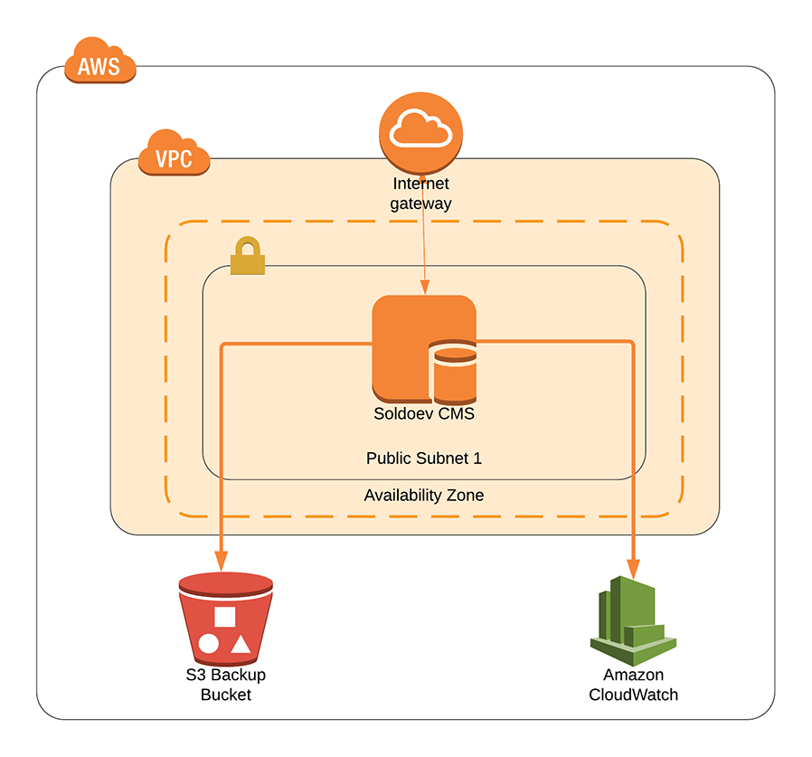
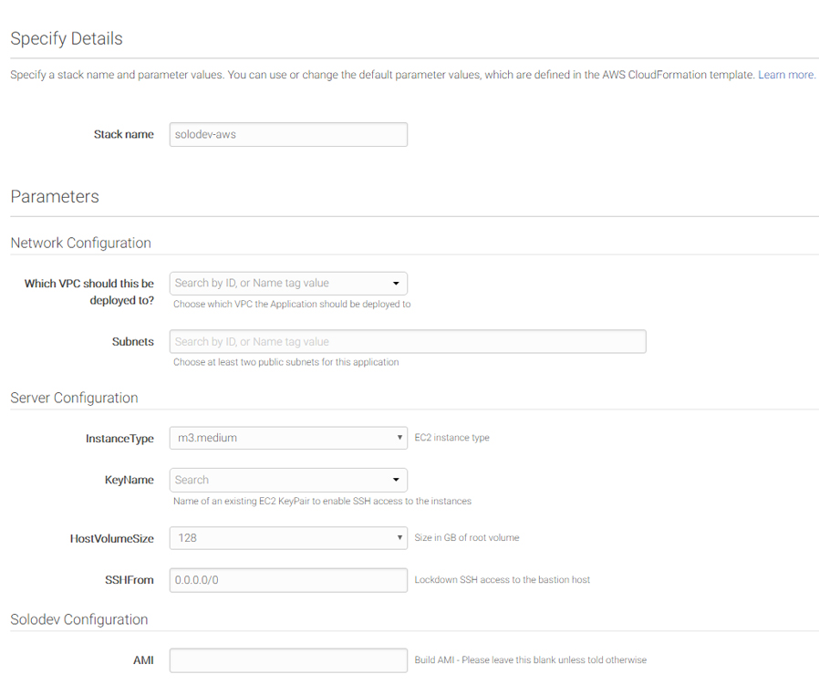

# Solodev CMS Lite
With one platform for creators, developers, and marketers, the Solodev CMS Lite puts you at the center of your digital universe and gives you total design freedom. Build space-age web applications with minimal code, all powered by the AWS Cloud.

## Overview
Solodev deployed on AWS uses a set of YAML templates for [Amazon Elastic Compute Cloud (Amazon EC2)](http://docs.aws.amazon.com/AWSEC2/latest/UserGuide/concepts.html).

## Prerequisites
Lorem ipsum dolor sit amet, consectetur adipiscing elit, sed do eiusmod tempor incididunt ut labore et dolore magna aliqua. Ut enim ad minim veniam, quis nostrud exercitation ullamco laboris nisi ut aliquip ex ea commodo consequat.

Duis aute irure dolor in reprehenderit in voluptate velit esse cillum dolore eu fugiat nulla pariatur. Excepteur sint occaecat cupidatat non proident, sunt in culpa qui officia deserunt mollit anim id est laborum.

## Steps to Run
To launch the entire stack and deploy on AWS, click on one of the ***Launch Stack*** links below.

You can launch this CloudFormation stack, using your account, in the following AWS Regions:

AWS Region Code             | Name                       | Launch 
----------------------------|----------------------------|:-------------------------:
us-east-1                   | US East (N. Virginia)      | 
us-east-2                   | US East (Ohio)             | 
us-west-1                   | US West (N. California)    | 
us-west-2                   | US West (Oregon)           | 
eu-west-1                   | EU (Ireland)               | 
eu-west-2                   | EU (London)                | 
eu-central-1                | EU (Frankfurt)             | 
ca-central-1                | Canada (Central)           | 

The above links will launch the "Select Template" wizard with the master template preselected. Click "Next" to customize the launch parameters.

## Parameters

Parameter                             | Description
------------------------------------- | ---------------------
Stack name     				          | The name of your stack
**Network Configuration**     		  | 
Which VPC should this be deployed to? | Choose which VPC the Application should be deployed to
Subnets     						  | Choose at least two public subnets for this application
**Server Configuration**              | 
InstanceType                          | EC2 instance type
KeyName                               | Name of an existing EC2 KeyPair to enable SSH access to the instances
HostVolumeSize                        | Size in GB of root volume
SSHFrom                               | Lockdown SSH access to the bastion host
**Solodev Configuration**             | 
AMI                                   | Build AMI - Please leave this blank unless told otherwise

## FAQs
1. Lorem ipsum dolor sit amet?
> Excepteur sint occaecat cupidatat non proident, sunt in culpa qui officia deserunt mollit anim id est laborum.

2. Lorem ipsum dolor sit amet?
> Excepteur sint occaecat cupidatat non proident, sunt in culpa qui officia deserunt mollit anim id est laborum.

3. Lorem ipsum dolor sit amet?
> Excepteur sint occaecat cupidatat non proident, sunt in culpa qui officia deserunt mollit anim id est laborum.

---
© 2018 Solodev. All rights reserved. 

Errors or corrections? Email us at help@solodev.com.

---
Visit [solodev.com](https://www.solodev.com/) to learn more. 
