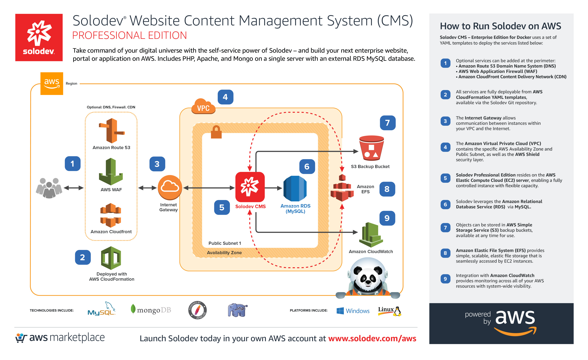
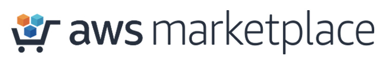
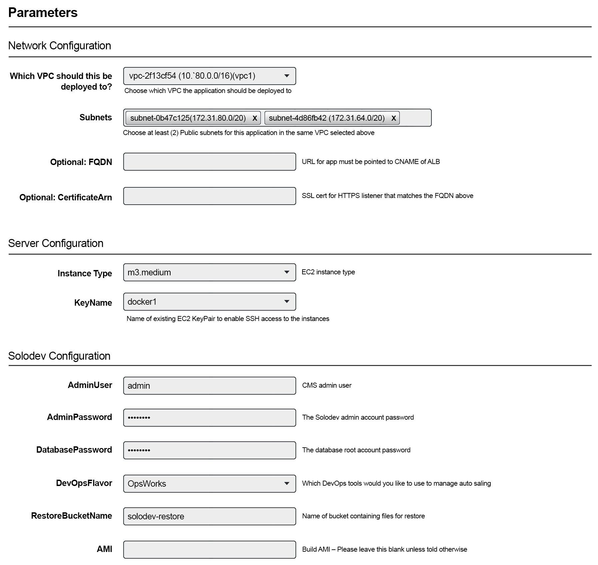
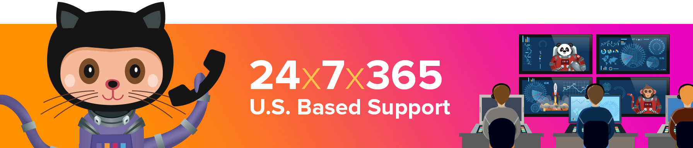



# Solodev CMS - Professional Edition
Take command of your digital universe! Get the full power of the galaxy's most advanced CMS and take your design and development to the stars and beyond. Professional Edition includes Solodev CMS, PHP, Apache, and Mongo on a single web server with an external RDS MySQL database – and available on-demand in the <a href="https://aws.amazon.com/marketplace/pp/B01LXZKO21?qid=1534773581495&sr=0-1&ref_=srh_res_product_title">AWS Marketplace</a>.

## Overview
Solodev CMS - Professional Edition on AWS uses a set of YAML templates including [Amazon Virtual Private Cloud (VPC)](http://docs.aws.amazon.com/AmazonVPC/latest/UserGuide/VPC_Introduction.html), [Amazon Elastic Compute Cloud (EC2)](http://docs.aws.amazon.com/AWSEC2/latest/UserGuide/concepts.html), [Amazon Relational Database Service (RDS)](http://docs.aws.amazon.com/AmazonRDS/latest/UserGuide/Welcome.html), [Amazon Simple Storage Service (S3)](https://docs.aws.amazon.com/AmazonS3/latest/dev/Welcome.html), [Amazon CloudWatch](https://docs.aws.amazon.com/AmazonCloudWatch/latest/monitoring/WhatIsCloudWatch.html), [Amazon CloudFront](http://docs.aws.amazon.com/AmazonCloudFront/latest/DeveloperGuide/Introduction.html), [Amazon Route 53](http://docs.aws.amazon.com/Route53/latest/DeveloperGuide/Welcome.html), [Amazon Web Application Firewall (WAF)](https://docs.aws.amazon.com/waf/latest/developerguide/what-is-aws-waf.html) and deployed by [AWS CloudFormation](http://docs.aws.amazon.com/AWSCloudFormation/latest/UserGuide/Welcome.html).

Getting to the Solodev Launchpad is easy. In just a few short steps, you'll be lifting off on AWS.

## Step 1: Subscribe on the AWS Marketplace

Solodev is a professionally managed, enterprise-class Content Management System (CMS). Before launching one of our products, you'll first need to subscribe to Solodev on the <a href="https://aws.amazon.com/marketplace/pp/B01LXZKO21?qid=1534773581495&sr=0-1&ref_=srh_res_product_title">AWS Marketplace.</a> Click the button below to get started: 
<table>
	<tr>
		<td width="70%"></td>
		<td></td>
	</tr>
</table>

Already have a Solodev license? Call <a href="tel:1.800.859.7656">1-800-859-7656</a> and we’ll activate your subscription for you.  

## Step 2: Return to this Solodev Product Page
Once you complete your subscription the AWS Marketplace, simply return to this Solodev CMS - Professional Edition product page.  

## Step 3: Configure Your VPC and EC2 Key Pair
Please note that both a <a href="http://docs.aws.amazon.com/AmazonVPC/latest/UserGuide/VPC_Introduction.html">VPC</a> and <a href="http://docs.aws.amazon.com/AWSEC2/latest/UserGuide/concepts.html">EC2 Key Pair</a> must be configured within the region you intend to launch your stack. If the following items are already created, you can skip directly to launch.  

## Step 4: Launch your CloudFormation Stack
Once you’ve configured your <a href="http://docs.aws.amazon.com/AmazonVPC/latest/UserGuide/VPC_Introduction.html">VPC</a> and <a href="http://docs.aws.amazon.com/AWSEC2/latest/UserGuide/concepts.html">EC2 Key Pair</a>, you can launch your CloudFormation stack. Select the AWS region of your choice below:  

<table>
	<tr>
		<th width="299">AWS Region Code</td>
		<th width="299">Name</td>
		<th width="299" align="center">Launch</td>
	</tr>
	<tr>
		<td>us-east-1</td>
		<td>US East (N. Virginia)</td>
		<td align="center"><a href="https://console.aws.amazon.com/cloudformation/home?region=us-east-1#/stacks/new?stackName=solodev-cms&templateURL=https://s3.amazonaws.com/solodev-aws-ha/aws/solodev-lite-single.yaml"></td>
	</tr>
	<tr>
		<td>us-east-2</td>
		<td>US East (Ohio)</td>
		<td align="center"><a href="#"></td>
	</tr>
	<tr>
		<td>us-west-1</td>
		<td>US West (N. California)</td>
		<td align="center"><a href="#"></td>
	</tr>
	<tr>
		<td>us-west-2</td>
		<td>US West (Oregon)</td>
		<td align="center"><a href="#"></td>
	</tr>
	<tr>
		<td>eu-west-1</td>
		<td>EU (Ireland)</td>
		<td align="center"><a href="#"></td>
	</tr>
	<tr>
		<td>eu-west-2</td>
		<td>EU (London)</td>
		<td align="center"><a href="#"></td>
	</tr>
	<tr>
		<td>eu-central-1</td>
		<td>EU (Frankfurt)</td>
		<td align="center"><a href="#"></td>
	</tr>
	<tr>
		<td>eu-central-2</td>
		<td>Canada (Central)</td>
		<td align="center"><a href="#"></td>
	</tr>
</table>
The above links will launch the "Select Template" wizard, with the master template preselected. Click the "Next" button to customize the launch parameters.

## Parameters
The following parameters must be configured to launch your Solodev CMS CloudFormation stack:

<table>
	<tr>
		<th width="300">Parameter</th>
		<th width="598">Description</th>
	</tr>
	<tr>
		<td>Stack name</td>
		<td> The name of your stack (set to "solodev-cms" by default)</td>
	</tr>
	<tr>
		<td colspan="2"><strong>--- Network Configuration ---</strong></td>
	</tr>
	<tr>
		<td>Which VPC should this be deployed to?</td>
		<td>Select which VPC the application should be deployed to</td>
	</tr>
	<tr>
		<td>Subnets</td>
		<td>Select at least two public subnets for this application</td>
	</tr>
	<tr>
		<td>(Optional) FQDN</td>
		<td>URL for app. FQDN must be pointed to CNAME of ALB.</td>
	</tr>
	<tr>
		<td>(Optional) CertficateArn</td>
		<td>SSL cert for HTTPS listener that matches the FQDN above</td>
	</tr>
	<tr>
		<td colspan="2"><strong>--- Server Configuration ---</strong></td>
	</tr>
	<tr>
		<td>InstanceType</td>
		<td>EC2 instance type</td>
	</tr>
	<tr>
		<td>KeyName </td>
		<td>Name of an existing EC2 KeyPair to enable SSH access to the instances</td>
	</tr>
	<tr>
		<td colspan="2"><strong>--- Solodev Configuration ---</strong></td>
	</tr>
	<tr>
		<td>AdminUser</td>
		<td>Admin user name in order to log in to the CMS after installation</td>
	</tr>
	<tr>
		<td>AdminPassword</td>
		<td>Admin account password in order to log in to the CMS after installation</td>
	</tr>
	<tr>
		<td>DatabasePassword</td>
		<td>The database root account password</td>
	</tr>
	<tr>
		<td>DevOpsFlavor</td>
		<td>Which DevOps tools would you like to use to manage auto scaling (set to "Opsworks" by default)</td>
	</tr>
	<tr>
		<td>RestoreBucketName</td>
		<td>Name of the S3 bucket containing files for restore</td>
	</tr>
	<tr>
		<td>AMI</td>
		<td>Build AMI - Please leave this blank unless told otherwise</td>
	</tr>
</table>

## Support
Houston, we have no problems… because Solodev Customer Care has your back at every step! From our world-class HelpDesk to our focused training sessions, you’ve got the best team on the ground to get you to the stars. 

Solodev Customer Care Includes
* 24x7x365 U.S. based human support
* Online HelpDesk ticketing
* Phone and email support
* Live training courses
* Over 600 pages of searchable documentation and tutorials

To learn more about our add-on support options, call 1-800-859-7656 to speak with one of our Solodev Customer Care Specialists.

## Need Help?

Solodev is a professionally managed, enterprise-class solution, and our team of certified engineers are here to support your success. While our self-serve options are easy to launch, you’ve always got a co-pilot at the helm. If you have any questions – or if you already have a Solodev license and need support with your AWS subscription – call <a href="tel:1.800.859.7656">1-800-859-7656</a> and we’ll help you get to the launchpad.

© 2018 Solodev. All rights reserved worldwide. And off planet. 

Errors or corrections? Email us at help@solodev.com.

---
Visit [solodev.com](https://www.solodev.com/) to learn more. 
