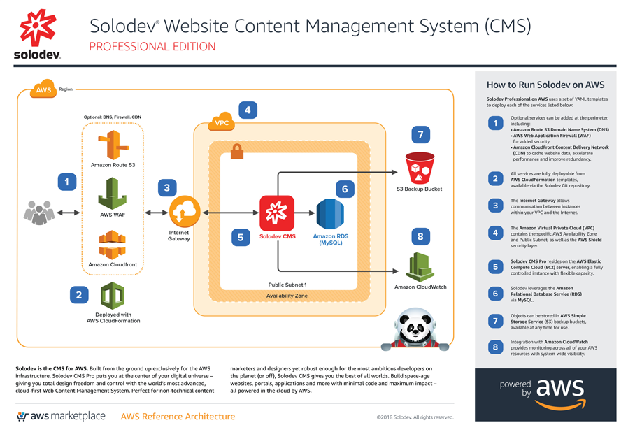

# Solodev CMS Pro
With one platform for creators, developers, and marketers, the Solodev CMS Pro puts you at the center of your digital universe and gives you total design freedom. Build space-age web applications with minimal code, all powered by the AWS Cloud.

## Overview
Solodev Pro on AWS uses a set of YAML templates including [Amazon Virtual Private Cloud (VPC)](http://docs.aws.amazon.com/AmazonVPC/latest/UserGuide/VPC_Introduction.html), [Amazon Elastic Compute Cloud (EC2)](http://docs.aws.amazon.com/AWSEC2/latest/UserGuide/concepts.html), [Amazon Relational Database Service (RDS)](http://docs.aws.amazon.com/AmazonRDS/latest/UserGuide/Welcome.html), [Amazon Simple Storage Service (S3)](https://docs.aws.amazon.com/AmazonS3/latest/dev/Welcome.html), [Amazon CloudWatch](https://docs.aws.amazon.com/AmazonCloudWatch/latest/monitoring/WhatIsCloudWatch.html), [Amazon CloudFront](http://docs.aws.amazon.com/AmazonCloudFront/latest/DeveloperGuide/Introduction.html), [Amazon Route 53](http://docs.aws.amazon.com/Route53/latest/DeveloperGuide/Welcome.html), [Amazon Web Application Firewall (WAF)](https://docs.aws.amazon.com/waf/latest/developerguide/what-is-aws-waf.html) and deployed by [AWS CloudFormation](http://docs.aws.amazon.com/AWSCloudFormation/latest/UserGuide/Welcome.html).

## Prerequisites
To launch Solodev Pro, you must first "Subscribe" to Solodev on the AWS Marketplace
1. Visit <a href="https://aws.amazon.com/marketplace/pp/B01LXZKO21?qid=1534773581495&sr=0-1&ref_=srh_res_product_title">Solodev on the AWS Marketplace</a>
2. Click on the "Continue to Subscribe" button
3. Click the "Subscribe" button
3. Return to this page and use one of the "Launch" buttons below

Please note that both a <a href="https://console.aws.amazon.com/vpc/home?region=us-east-1#vpcs:">VPC</a> and an <a href="https://console.aws.amazon.com/ec2/v2/home?region=us-east-1#KeyPairs:sort=keyName">EC2 Key Pair</a> must be configured within the region you intend to launch the stack. If the following items are already created, you can skip to launch.

## Steps to Run
To launch the entire stack and deploy on AWS, click on one of the ***Launch Stack*** links below.

You can launch this CloudFormation stack, using your account, in the following AWS Regions:

<table>
	<tr>
		<th width="299">AWS Region Code</td>
		<th width="299">Name</td>
		<th width="299" align="center">Launch</td>
	</tr>
	<tr>
		<td>us-east-1</td>
		<td>US East (N. Virginia)</td>
		<td align="center"><em>Coming Soon</em></td>
	</tr>
	<tr>
		<td>us-east-2</td>
		<td>US East (Ohio)</td>
		<td align="center"><em>Coming Soon</em></td>
	</tr>
	<tr>
		<td>us-west-1</td>
		<td>US West (N. California)</td>
		<td align="center"><em>Coming Soon</em></td>
	</tr>
	<tr>
		<td>us-west-2</td>
		<td>US West (Oregon)</td>
		<td align="center"><em>Coming Soon</em></td>
	</tr>
	<tr>
		<td>eu-west-1</td>
		<td>EU (Ireland)</td>
		<td align="center"><em>Coming Soon</em></td>
	</tr>
	<tr>
		<td>eu-west-2</td>
		<td>EU (London)</td>
		<td align="center"><em>Coming Soon</em></td>
	</tr>
	<tr>
		<td>eu-central-1</td>
		<td>EU (Frankfurt)</td>
		<td align="center"><em>Coming Soon</em></td>
	</tr>
	<tr>
		<td>eu-central-2</td>
		<td>Canada (Central)</td>
		<td align="center"><em>Coming Soon</em></td>
	</tr>
</table>

---
© 2018 Solodev. All rights reserved. 

Errors or corrections? Email us at help@solodev.com.

---
Visit [solodev.com](https://www.solodev.com/) to learn more. 
